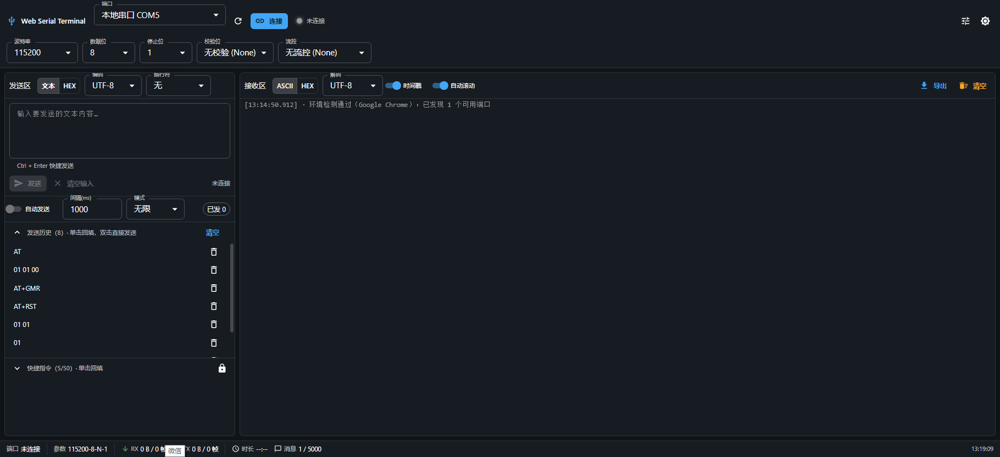
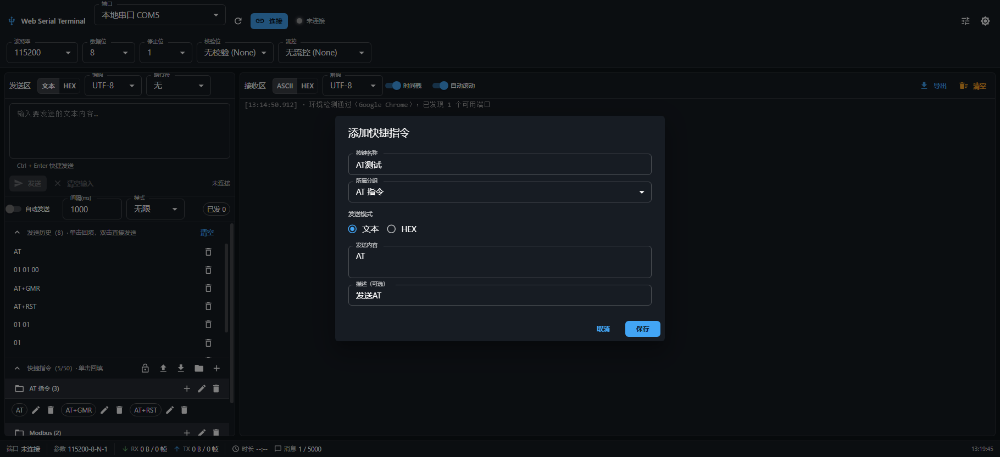

# Web Serial Terminal

[](https://opensource.org/licenses/MIT)
[](https://go.dev/)
[](https://nodejs.org/)


基于 **Web Serial API** 的串口调试终端，支持 Web 版和桌面版。零安装、零后端，打开网页即可连接串口设备。

## 截图

**主界面**



**快捷指令面板**



## 特性

### 已实现功能

#### P0 核心功能（已完成 ✅）
- ✅ 端口授权与连接
- ✅ 串口参数配置（波特率/数据位/停止位/校验/流控）
- ✅ 文本收发
- ✅ HEX 收发
- ✅ ASCII/HEX 显示切换
- ✅ 连接状态指示
- ✅ 断开连接

#### P1 增强功能（已完成 ✅）
- ✅ **时间戳显示**：`HH:mm:ss.SSS` 格式，可开关
- ✅ **日志导出**：导出为 `.txt` 文件
- ✅ **虚拟滚动**：使用 `react-window` 优化高频数据渲染
- ✅ **批量刷新节流**：60ms 批量刷新避免卡顿
- ✅ **自动发送**：定时发送、定次发送、断开自动停止、自校正定时器
- ✅ **发送历史**：最近 50 条、点击回填、双击直发、清空、持久化
- ✅ **配置持久化**：参数保存到 localStorage，刷新后恢复
- ✅ **多编码支持**：UTF-8 / GBK 编码（懒加载），解码失败自动降级

#### P2 高级功能（已完成 ✅）
- ✅ **明暗主题**：主题切换按钮，持久化到 localStorage
- ✅ **RTS/DTR 信号线控制**：一键下载复位、输入信号线显示
- ✅ **快捷指令面板**：
  - 支持分组管理（创建、编辑、删除、折叠/展开）
  - 快捷指令可关联分组，支持文本/HEX 模式
  - 鼠标悬停显示详细内容，单击回填/发送
  - 配置导入导出（JSON 格式），支持数据校验
  - 配置持久化到 localStorage
- ✅ **多窗口多设备**：支持同时打开多个窗口连接不同设备，数据隔离
- ✅ **自动断开**：页面关闭/刷新时自动断开串口连接

## 运行环境要求

| 项 | 要求 |
|----|------|
| 浏览器 | Chrome / Edge **89+**（Chromium 内核）。Firefox / Safari **不支持** Web Serial |
| 上下文 | 必须是 **安全上下文**：`https://` 或 `http://localhost` |
| 操作系统 | Windows / macOS / Linux（Linux 需当前用户有 `/dev/ttyUSB*` 权限，通常加入 `dialout` 组）|

> 非 Chromium 或非安全上下文访问时，页面会渲染「不支持引导页」并说明原因，不会白屏。

## 桌面版构建

本项目支持打包为 Windows 桌面应用，支持在 Windows、Linux、macOS 上交叉编译。

### 依赖要求

- **Node.js** 18+ - [下载地址](https://nodejs.org/)
- **Go** 1.21+ - [下载地址](https://go.dev/dl/)

### Windows 构建运行 `build.bat` 完成完整构建：

```bash
.\build.bat
```

### Linux / macOS 构建

运行 `build.sh` 完成完整构建：

```bash
chmod +x build.sh
./build.sh
```

> **注意**：`build.sh` 使用交叉编译生成 Windows `.exe` 文件，适用于在 Linux/macOS 上为 Windows 构建程序。

### 构建步骤

脚本会自动执行：

1. **检查依赖** - 验证 Node.js 和 Go 是否已安装
2. **构建前端** - 运行 `npm run build` 生成静态文件到 `dist/` 目录
3. **复制静态文件** - 将前端文件复制到 `backend/internal/static/dist/`
4. **构建后端** - 编译 Go 代码生成可执行文件

### 输出文件

构建完成后，可执行文件位于：

```
dist/web-serial-terminal.exe
```

文件大小约 9-10MB。

### 运行程序

双击 `dist/web-serial-terminal.exe`，程序会：

1. 自动打开浏览器访问 http://localhost:8080
2. 选择串口设备并配置参数
3. 开始调试

### 手动构建（可选）

如果需要分步构建：

**Windows:**

```bash
# 1. 安装依赖
npm install

# 2. 构建前端
npm run build

# 3. 复制静态文件
mkdir backend\internal\static\dist
xcopy /E /I /Y dist backend\internal\static\dist

# 4. 构建后端
cd backend
go build -ldflags="-H windowsgui -s -w" -o ..\dist\web-serial-terminal.exe .
```

**Linux / macOS (交叉编译 Windows 版):**

```bash
# 1. 安装依赖
npm install

# 2. 构建前端
npm run build

# 3. 复制静态文件
mkdir -p backend/internal/static/dist
cp -r dist/* backend/internal/static/dist/

# 4. 构建后端（交叉编译 Windows 版）
cd backend
CGO_ENABLED=0 GOOS=windows GOARCH=amd64 go build -ldflags="-s -w" -o ../dist/web-serial-terminal.exe .
```

### 常见问题

**前端构建失败**
- 确保 `node_modules` 已安装：`npm install`
- 检查 Node.js 版本：`node -v`

**Go 编译失败**
- 检查 Go 版本：`go version`
- 运行 `go mod tidy` 更新依赖
- 检查静态文件是否已复制到正确位置

**程序运行时无法找到静态文件**
- 确保构建时静态文件在 `backend/internal/static/dist/` 目录
- 该目录通过 Go 的 embed 机制嵌入到可执行文件中

## Web 版开发

如需开发 Web 版本（无需桌面打包）：

```bash
npm install
npm run dev
```

浏览器打开 `http://localhost:5173`（localhost 属于安全上下文，可直接使用串口）。

## Web 版构建与部署

```bash
npm run build      # 产物输出到 dist/
npm run preview    # 本地预览构建产物
```

`dist/` 为纯静态产物，可托管到任意静态服务器。**部署时必须启用 HTTPS**，否则浏览器会禁用 `navigator.serial`。

Nginx 示例：

```nginx
server {
    listen 443 ssl;
    server_name serial.example.com;
    ssl_certificate     /path/fullchain.pem;
    ssl_certificate_key /path/privkey.pem;

    root /var/www/web-serial-terminal/dist;
    index index.html;

    location / {
        try_files $uri $uri/ /index.html;
    }
}
```

> `vite.config.ts` 中 `base: './'` 已使用相对路径，可部署在任意子目录（如 GitHub Pages 的 `/repo/`）。

## 目录结构

```
src/
├── main.tsx                 # 入口：ThemeProvider + CssBaseline + 错误边界
├── App.tsx                  # 顶层组装：环境探测分支 + profile 初始化 + 页面关闭自动断开
├── index.css                # Tailwind 指令 + 等宽字体 + 滚动条
├── theme/theme.ts           # MUI 明暗双主题
├── types/serial.ts          # 全局唯一类型源
├── serial/                  # 领域层（零 React 依赖）
│   ├── SerialService.ts     # Web Serial 全封装 + 合帧 + 幂等关闭协议
│   └── serialSupport.ts     # 环境探测与端口友好名
├── store/                   # Zustand 状态层
├── utils/                   # 纯函数工具
│   ├── hex.ts               # HEX 编解码（唯一入口）
│   ├── codec.ts             # UTF-8/GBK 编码（唯一入口）
│   ├── format.ts            # 时间戳格式化
│   ├── storage.ts           # localStorage 持久化
│   ├── macroExporter.ts     # 快捷指令配置导入导出
│   ├── exporter.ts          # 日志导出
│   └── crc.ts               # CRC 校验
├── hooks/                   # 编排层
│   └── useSerialConnection.ts  # 串口连接逻辑（支持多窗口独立实例）
└── components/              # 视图层
    └── send/
        └── MacroPanel.tsx   # 快捷指令面板（分组管理 + 导入导出）
```

## 架构约定（贡献者必读）

1. **字节是唯一事实来源**：`MessageRecord.raw` 保存原始字节，ASCII/HEX 展示是对 raw 的实时投影。
2. **HEX 唯一入口** `@/utils/hex`，**编码唯一入口** `@/utils/codec`，禁止组件内自行 `toString(16)` 或 `new TextEncoder()`。
3. **依赖方向**：`components → hooks → { store, serial, utils, types }`；`serial` 层禁止 import `store` / React。
4. **样式分工**：Tailwind 管布局，MUI 管视觉；Tailwind 已关闭 `preflight`。
5. **错误统一**为 `SerialError { code, message, cause }`；`E_NO_PORT_SELECTED` 与 `E_READ_ABORTED` 属正常路径，不弹红色错误。

## 已知限制

- **多窗口多设备**：Web 版本通过后端 WebSocket 实现，每个窗口独立管理串口；桌面版每个窗口独立运行。
- GBK **解码**使用浏览器原生 `TextDecoder('gbk')`；GBK **编码**依赖懒加载的 `gbk.js`，加载失败时自动降级为 UTF-8 并提示。
- 接收报文不落盘（仅内存环形缓冲 5000 条 + 手动导出），避免 localStorage 爆容量。
- 数据曲线（DataChart）为预留占位，暂未实现。
